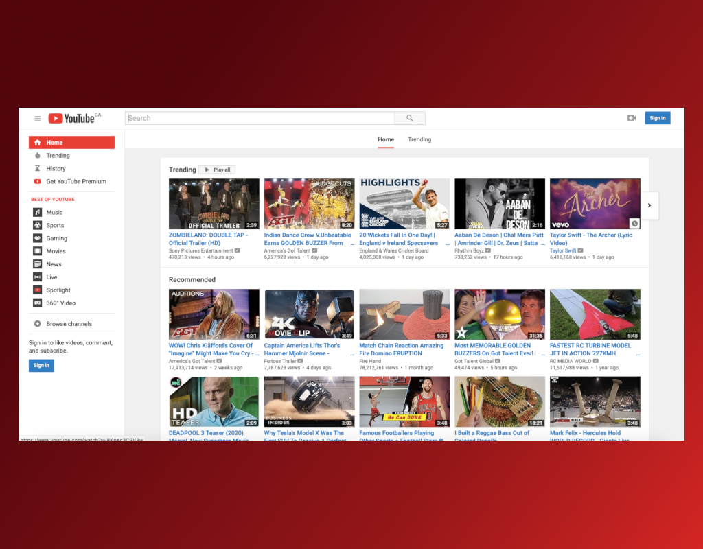

# Fast Youtube Load <a href='https://ko-fi.com/S6S5S3WU' target='_blank'>

YouTube page load is 5x slower in Firefox than in Chrome because YouTube's Polymer redesign relies on the deprecated Shadow DOM v0 API only implemented in Chrome. This extension helps you to load more faster the page in your Firefox.

## Requirements
* Firefox 57.0 or later

## How Works
To make loading faster there are several procedures that even change the appearance of YouTube to a previous pre-Polymer design and that helps in terms of website performance in Firefox. If you can make a comparison when using the add-on you will see a big difference in loading speed in about 5x. 

## How Contribute
Have a suggestion, doubt or encountered an error? Please open a new [issue](https://github.com/jhonatasrm/Fast-YouTube-Load/issues)

Contributions are welcome, feel free to submit a pull :)

## Learn More 
To learn more about webextensions development, see this [Mozilla developer Network documentation](https://developer.mozilla.org/en-US/Add-ons/WebExtensions)
